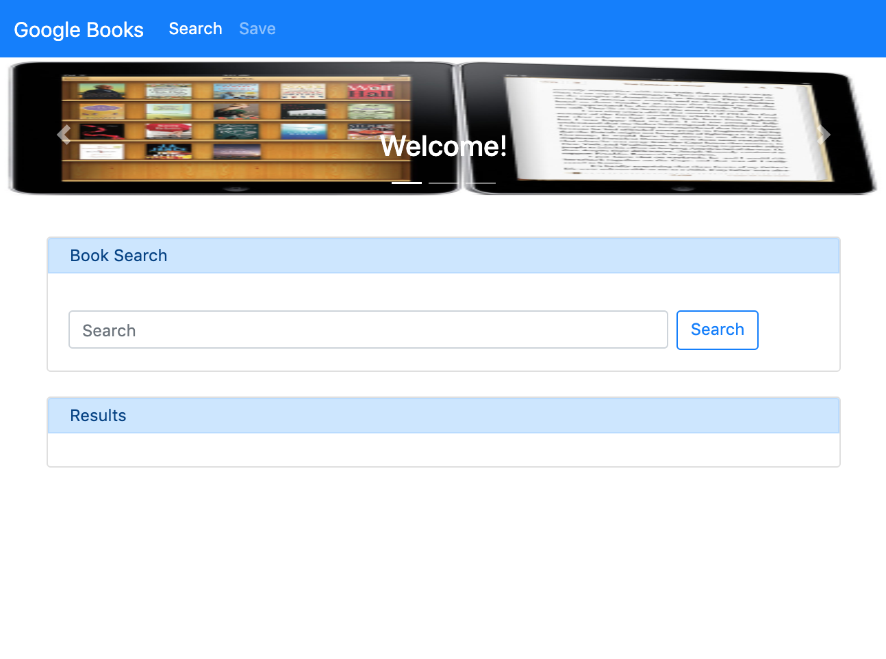
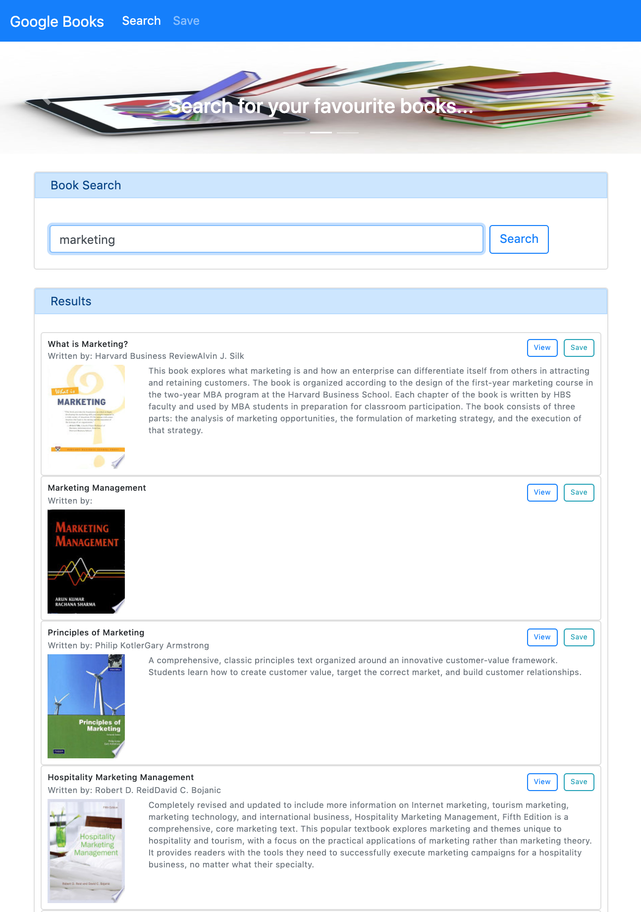
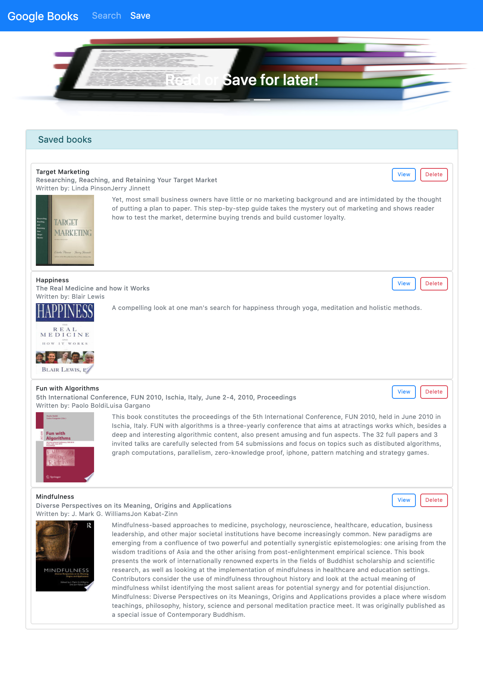

# Google Books

A Google Books based search app.
Technologies used: Node, Express, MongoDB and React.

## Badges

Code quality and validation

Repository Status

License

## Table of contents

- [Google Books](#google-books)
  - [Badges](#badges)
  - [Table of contents](#table-of-contents)
  - [The challenge](#the-challenge)
  - [The development process](#the-development-process)
  - [The Output](#the-output)
  - [Installation and Usage](#installation-and-usage)
  - [Credits, tools and other references](#credits-tools-and-other-references)
  - [Contributing](#contributing)
  - [Questions](#questions)

## The challenge

To create React components, work with helper/util functions, and utilize React lifecycle methods to query and display books based on user searches.

Main elements:

- [x] Search Google Books page.
- [x] Results and Cards components.
- [x] Saved Books page.

## The development process

In order to accomplish the challenge, the following steps were done:

1. Define the purpose, and concept of the application.
2. Understand Google Books documentation.
3. Create React project.
4. Set the server up.
5. Define the Books model and seed.
6. Define the database connection in the server.
7. Define the application routes and controllers.
8. Define the Google Books route and controller.
9. Integrate React-Bootstrap.
10. Create application's pages and components.
11. Integrate front end with the back end.
12. Testing and documentation.

## The Output

With the described process we were able to create a useful, efficient, Google Books API based application.

**User stories**

1. As a user, I want to have a form, so that I can search for books in the Google Books sources.
2. As a user, I want to get the results of my search, so that I can see the volumes' information available like Title, Subtitle, Authors, Description, and Book image.
3. As a user, I want to have a link for each searched book, so that I can click on it and be re-directed externally to the Google book detail information.
4. As a user, i want to have a Save button, so that I can save the books of my preference.
5. As a user, I want to have a Saved books page, so that all my saved books are displayed.
6. As a user, I want to have Delete button on each of my saved books, so that I can delete the book from my saved books.
7. As a user, I want to get notification alerts after clicking on the Save and Delete buttons, so that I can be sure the success of my operations.

**The application**

## Installation and Usage

The project was uploaded to [GitHub](https://github.com/) at the following repository:
[https://github.com/jorguzman100/21_google_books](https://github.com/jorguzman100/21_google_books)

You can access the deployed application with the Heroku link:

To install the project follow these steps:

1. Clone the application from GitHub with:
   - git clone [clone link from GitHub]
2. From the root folder, install the dependencies with:
   - npm install
3. Run the app with:
   - npm start

## Credits, tools and other references

**Third Party Assets**

[Google Books API](https://developers.google.com/books/docs/v1/getting_started)

[React-Bootstrap](https://react-bootstrap.github.io/)

[MongoDB Atlass Database](https://www.mongodb.com/cloud/atlas/lp/try2?utm_source=google&utm_campaign=gs_emea_estonia_search_brand_atlas_desktop&utm_term=mongodb%20atlas&utm_medium=cpc_paid_search&utm_ad=e&utm_ad_campaign_id=9510384840&gclid=Cj0KCQjwhb36BRCfARIsAKcXh6Hwy3z3qrPc-p0z4mYaeHPegSxWU0HqMPgzbtZdJRtPtNCX0XOKtOMaApbyEALw_wcB)

[Shields.io](https://shields.io/)

[LGTM](https://lgtm.com/)

[Markup Validation Service](https://validator.w3.org/)

**Tutorials**

[React Bootstrap Tutorial](https://www.youtube.com/watch?v=8pKjULHzs0s)

[3.4 Hiding API Keys with Environment Variables (dotenv) and Pushing Code to GitHub](https://www.youtube.com/watch?v=17UVejOw3zA)

## Contributing

- Pull requests are welcome.
- For major changes, please open an issue first to discuss what you would like to change.
- Please make sure to update tests as appropriate.

## Questions

If you have questions or you want to share comments, we will be glad to hear from you. Please contact us at jorguzman100@gmail.com.
