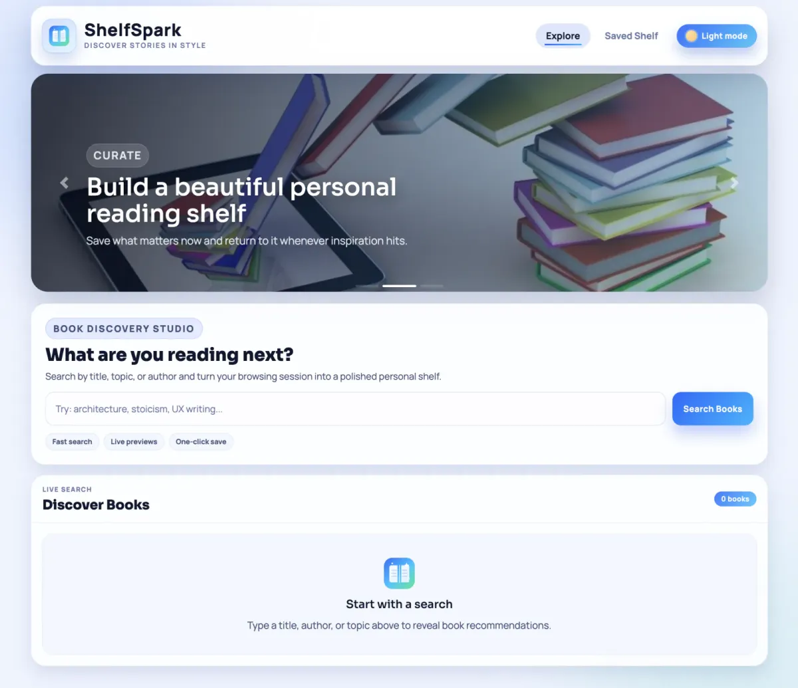

# 📚 ShelfSpark

### Search books fast, preview them, and build a saved reading shelf that actually feels nice to use.

ShelfSpark is a full-stack Google Books app built with React, Express, and MongoDB. It lets you search the Google Books API, preview titles, and save your favorite finds into a personal shelf you can manage later.

---

## ✨ Features

| | Feature | What It Does |
|---|---|---|
| 🔎 | Smart book search | Search Google Books by title, topic, or author from a clean UI |
| 🧾 | Rich result cards | Shows title, subtitle, authors, cover, description, and preview link |
| 💾 | Save to shelf | Save books to MongoDB with one click |
| 🗑️ | Shelf management | Remove books from your saved collection anytime |
| ✅ | Feedback alerts | Clear success/error messages for save/delete/search actions |
| 🎨 | Polished UI | Responsive layout, carousel hero, and light/dark theme toggle |

---

<p align="center">
  
</p>

---

## 🛠️ Tech Stack


---

## 🧩 Project Snapshot

- MERN-style app with an Express API + React client (`client/`) and MongoDB persistence for saved books
- API routes include Google Books proxy search (`/api/Google_API/:query`) and saved books CRUD (`/api/books`)
- Backend uses `dotenv` for secrets and supports local MongoDB or hosted MongoDB via `MONGODB_URI`
- Frontend includes Search and Saved Shelf flows, reusable result cards, and a responsive themed UI
- Includes a seed script (`npm run seed`) for sample books if you want local starter data

---

## 🚀 Live Demo

[](https://shelfspark.onrender.com/)

[](https://portfolio.jorgeguzman.dev/)


---

## 💻 Run it locally

```bash
git clone https://github.com/jorguzman100/google-books.git
cd google-books
npm install
cp .env_example .env
npm start
```

Optional seed data (requires MongoDB running):

```bash
npm run seed
```

Local URLs:

- Frontend: `http://localhost:3000`
- API: `http://localhost:3001`

<details>
<summary>🔑 Required environment variables</summary>

```env
# .env (backend)
MONGODB_LOCAL=mongodb://127.0.0.1:27017/reactGoogleBooks
# Optional if using Atlas/hosted MongoDB:
MONGODB_URI=
GOOGLE_BOOKS_API_KEY=
PORT=3001
```

No `client/.env` file is required right now.
</details>

---

## 🤝 Contributors

- **Jorge Guzman**  ·  [@jorguzman100](https://github.com/jorguzman100)

---
